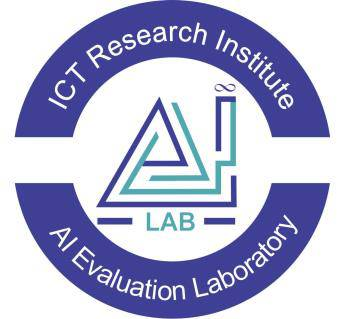

# Innovation and Development Center for Artificial Intelligence (AI)

  

## Chairman
**Mohammad Hadi Bokaei**

## Members
- Alireza Parvaresh
- Elahe Ehteshami
- Mojgan Farhoudi
- Erfan Shakouri

## Introduction
The subject of Artificial Intelligence (AI) and its applications has been at the forefront of strategic programs in developed countries in recent years. It is predicted that AI will have profound impacts on various aspects of human life in the coming years. In response to this trend, the Innovation and Development Center for Artificial Intelligence was established within the research institute with the aim of focusing on planning and implementing research activities centered around AI. The center has now officially commenced its operations.

## AI Assigned Missions
- **Develop Interactions:** Enhance collaborations with industries, businesses, universities, research institutes, and international centers to define and execute joint research and applied projects.
- **Provide Infrastructure and Data:** Supply the necessary infrastructures and data for researchers, startups, various industrial sectors, agriculture, and e-government.

## Main Mission Tasks

### 1. Legal Infrastructure Development Group
- Establish a regulatory and legal authority for the AI domain.
- Draft preliminary versions of laws, regulations, guidelines, and ethical principles required for AI development.
- Formulate and propose intellectual property policies suited to the AI environment.
- Assist in deregulation efforts to promote AI expansion.
- Help increase trust in AI systems.
- Develop standards and test and evaluate the competence of AI-based systems.
- Conduct evaluations and rankings of companies and universities based on various AI indicators, with periodic publications.
- Establish certification mechanisms for companies using user data to prevent data misuse.
- Provide clarity and transparency in AI systems for the general public.
- Survey the community regarding challenges arising from AI implementation.
- Prepare service descriptions and proposals for AI contracts.
- Supervise and monitor the center’s and research institute’s AI projects from a legal perspective.

### 2. Service Development and Resource Management Group
- Provide the infrastructure for data maintenance, processing, and computational capacity for AI research needs.
- Offer AI products and platforms derived from joint projects with a specialized marketplace.
- Manage data cleaning and the production of standardized data.
- Collect and store data from various organizations and companies.
- Aggregate and share produced data as sample datasets in the public digital space.
- Establish reliable mechanisms for data sharing.

### 3. Strategy and Business Development Group
- Engage with major companies and industries to define challenges, sign contracts to solve them, and implement AI under the banner of developing AI applications in the country.
- Monitor and evaluate the state of AI in Iran and globally.
- Conduct studies to identify applications of AI in various fields.
- Observe the AI strategies of different countries.
- Continuously monitor the status of AI-related businesses in Iran and worldwide.
- Measure the level of AI adoption by both public and private sectors.
- Interact with key institutions and businesses to conduct studies and provide consultations in various AI domains.
- Undertake strategic studies to define national-level AI challenges.
- Share processing and storage infrastructures and manage data streams for the Service Group.
- Expand relations with startup associations in key areas through the Innovation Expansion Group.

### 4. Scientific and Research Development Group
- Conduct joint research with partner universities based on AI to solve strategic challenges.
- Execute projects defined by the Strategy and Business Development Group.
- Collaborate with universities and other operators to establish a high-speed processing network for AI (through sharing AI-HPC resources).
- Provide various data services via API Gateway/Management to ensure researchers have access to necessary data.

### 5. Innovation Expansion Group
- Monitor the status of startups and specialized professionals, and engage with them in various AI fields to support and facilitate their growth.
- Assess needs and bolster the innovation process among startups and knowledge-based companies through:
  - Organizing competitions and various events.
  - Hosting exhibitions to showcase practical AI achievements.
  - Collaborating with specialized AI training centers.
  - Launching national awards and challenges.
- Promote and cultivate a culture of AI usage through:
  - Translating and publishing prominent AI books in the community.
  - Launching a website to disseminate the latest domestic and international achievements in various AI development fields.
  - Establishing connections with international bodies, particularly to improve the country’s ranking based on various indices.
  - Networking at national, regional, and international levels in the AI field.
  - Assisting in the development of human resources in AI.
  - Supporting the development of an innovative AI ecosystem.

## Evaluation Laboratory
**We are an Artificial Intelligence Evaluation Laboratory, and indeed we evaluate AI products and services in Iran.**

## Services
All major industries, startups, as well as universities, innovation parks, and innovation centers are invited to send their proposals for collaboration to the following email address: [mh.bokaei@itrc.ac.ir](mailto:mh.bokaei@itrc.ac.ir).

